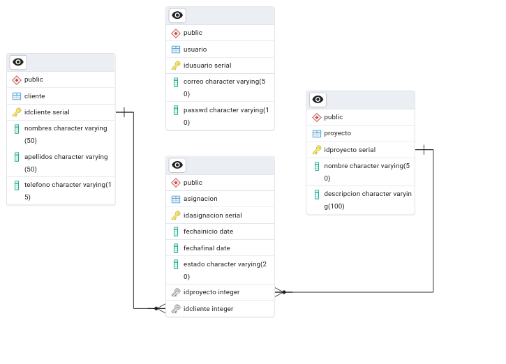
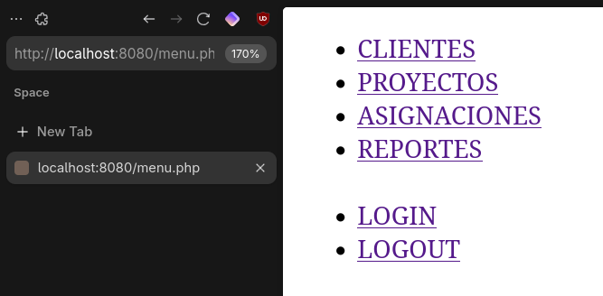
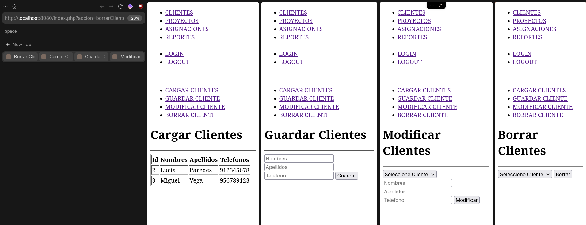
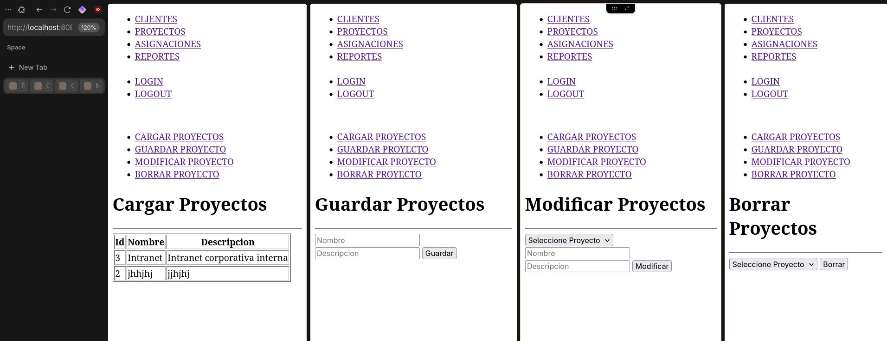
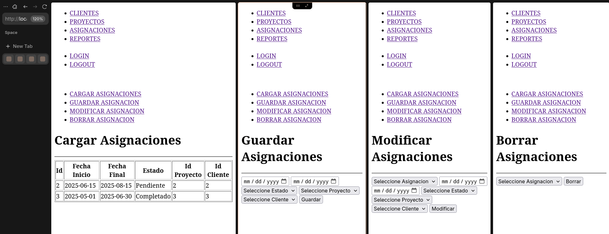
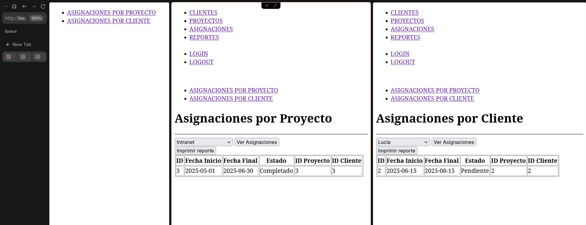
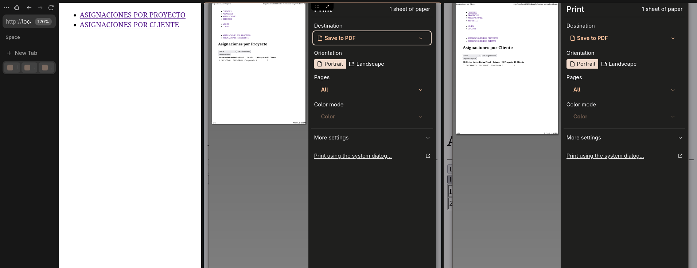

# PHP Gestion de Clientes y Proyectos

Tema: Administrar sistemas de informacion Backend.
Objetivo: Usa PHP, PDO, MYSQL o POSTGRES, POO, MVC y otras tecnologias para crear una pagina web.

## Caso
El cliente necesita de los siguientes modulos
- gestion de clientes y projectos
- login con autenticacion
- generar reportes en pdf

## Solucion

- Infraestructura basada en la web ocn php y postgres
- Patron de diseno MVC
- POO para la reutilizacion y mantenimiento del codigo
- PDO para la conceccion a la base de datos.
- Funciones de seguridad.
- etc.

## Ejecucion

- Instalar Docker Desktop (solo windows)
- Levantamiento de la aplicacion:
  ```bash
  docker-compose build --no-cache
  docker-compose up -d
  ```
- Para dejar de ejecutar la aplicacion escribir:
  ```bash
  docker-compose down -v
  ```
- acceso a pgadmin ...


## Imagenes

### Base de datos


### Autenticación y Navegación




### Gestión de Clientes


### Gestión de Proyectos


### Gestión de Asignaciones


### Reportes



