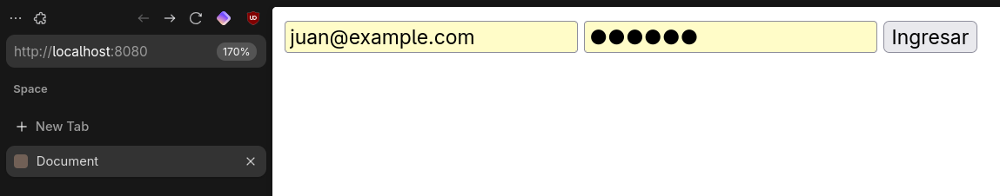

# PHP Clients

Tema: Administrar sistemas de informacion Backend.
Objetivo: Usa PHP, PDO, MYSQL o POSTGRES, POO, MVC y otras tecnologias para crear una pagina web.

## Caso
El cliente necesita de los siguientes modulos
- gestion de clientes y projectos
- login con autenticacion
- generar reportes en pdf

## Solucion

- Infraestructura basada en la web ocn php y postgres
- Patron de diseno MVC
- POO para la reutilizacion y mantenimiento del codigo
- PDO para la conceccion a la base de datos.
- Funciones de seguridad.
- etc.

## Imagenes

### Autenticación y Navegación

### Gestión de Clientes

### Gestión de Proyectos

### Gestión de Asignaciones

### Reportes

